  

  
  

  
  
  

  

  

  

  

<table width="100%">
<tr>
<td width="50%" valign="top">

#### 🌐 **Academic & Professional Focus**
 

* <svg xmlns="http://www.w3.org/2000/svg" width="10" height="10" viewBox="0 0 8 8" style="display:inline-block;vertical-align:middle;margin-right:6px;"><circle cx="4" cy="4" r="3" fill="#73d2de"/></svg> **AI & Machine Learning**: LLM integration, RAG systems, fine-tuning
* <svg xmlns="http://www.w3.org/2000/svg" width="10" height="10" viewBox="0 0 8 8" style="display:inline-block;vertical-align:middle;margin-right:6px;"><circle cx="4" cy="4" r="3" fill="#73d2de"/></svg> **Full Stack Development**: Next.js, React, Node.js, PostgreSQL
* <svg xmlns="http://www.w3.org/2000/svg" width="10" height="10" viewBox="0 0 8 8" style="display:inline-block;vertical-align:middle;margin-right:6px;"><circle cx="4" cy="4" r="3" fill="#73d2de"/></svg> **Cloud & DevOps**: Docker, AWS, deployment optimization
* <svg xmlns="http://www.w3.org/2000/svg" width="10" height="10" viewBox="0 0 8 8" style="display:inline-block;vertical-align:middle;margin-right:6px;"><circle cx="4" cy="4" r="3" fill="#73d2de"/></svg> **Cybersecurity & EdTech**: Building secure, scalable educational platforms

</td>
<td width="50%" valign="top">

#### 🏆 **Achievements & Credentials**
 

* <svg xmlns="http://www.w3.org/2000/svg" width="10" height="10" viewBox="0 0 8 8" style="display:inline-block;vertical-align:middle;margin-right:6px;"><circle cx="4" cy="4" r="3" fill="#7b2ff7"/></svg> **Lead Software Engineer** at Tensor Security Academy
* <svg xmlns="http://www.w3.org/2000/svg" width="10" height="10" viewBox="0 0 8 8" style="display:inline-block;vertical-align:middle;margin-right:6px;"><circle cx="4" cy="4" r="3" fill="#7b2ff7"/></svg> **Director** — Website & App Development, AUST Robotics Club
* <svg xmlns="http://www.w3.org/2000/svg" width="10" height="10" viewBox="0 0 8 8" style="display:inline-block;vertical-align:middle;margin-right:6px;"><circle cx="4" cy="4" r="3" fill="#7b2ff7"/></svg> **Open Source Contributor** — Multiple live production projects
* <svg xmlns="http://www.w3.org/2000/svg" width="10" height="10" viewBox="0 0 8 8" style="display:inline-block;vertical-align:middle;margin-right:6px;"><circle cx="4" cy="4" r="3" fill="#7b2ff7"/></svg> **2+ Years** in professional software development & IT consulting

</td>
</tr>
</table>

  

  

<h3 align="center">「 Technical Architecture & Animated Stack 」</h3>

  

 

  

 

  
  
  

  

  

| <svg xmlns="http://www.w3.org/2000/svg" width="16" height="16" viewBox="0 0 24 24" fill="none" stroke="#73d2de" stroke-width="2" stroke-linecap="round" stroke-linejoin="round"><path d="M22 19a2 2 0 0 1-2 2H4a2 2 0 0 1-2-2V5a2 2 0 0 1 2-2h14a2 2 0 0 1 2 2z"></path><polyline points="16 3 12 7 8 3"></polyline></svg> **Tensor Security Academy** | *Live Cybersecurity EdTech Platform — Built Solo* |
| :--- | :--- |
| |   - **AI Integration**: Custom AI Agent, chatbot for interactive learning - **Real-time Progress**: Dashboard with adaptive learning paths - **Scalable Architecture**: Docker containerization, optimized for 1000+ concurrent users - **Security First**: Encrypted user data, secure API endpoints  [🔗 Live Link](https://www.tensorsecurityacademy.com/) |

  

| <svg xmlns="http://www.w3.org/2000/svg" width="16" height="16" viewBox="0 0 24 24" fill="none" stroke="#73d2de" stroke-width="2" stroke-linecap="round" stroke-linejoin="round"><path d="M22 19a2 2 0 0 1-2 2H4a2 2 0 0 1-2-2V5a2 2 0 0 1 2-2h14a2 2 0 0 1 2 2z"></path><polyline points="16 3 12 7 8 3"></polyline></svg> **AUST Robotics Club Portal** | *Official Club Platform* |
| :--- | :--- |
| |   - **Updates**: Event calendar, announcements, and project showcases - **Project Gallery**: Interactive showcase of robotics projects - **Member Directory**: Connect with club members - **Real-time Notifications**: Push updates for events  [🔗 Live Link](https://austrc.com/) |

  

| <svg xmlns="http://www.w3.org/2000/svg" width="16" height="16" viewBox="0 0 24 24" fill="none" stroke="#73d2de" stroke-width="2" stroke-linecap="round" stroke-linejoin="round"><path d="M22 19a2 2 0 0 1-2 2H4a2 2 0 0 1-2-2V5a2 2 0 0 1 2-2h14a2 2 0 0 1 2 2z"></path><polyline points="16 3 12 7 8 3"></polyline></svg> **Brain MRI Visual QA System** | *Visual Question Answering for Brain MRI Scans* |
| :--- | :--- |
| |   - **Model Fine-Tuning**: Qwen2-VL-2B model fine-tuned on medical imaging datasets - **Interactive Interface**: Gradio-powered web UI for medical professionals - **Accuracy**: Optimized for radiological analysis and diagnosis support - **Deployment**: Production-ready medical AI solution |

  

| <svg xmlns="http://www.w3.org/2000/svg" width="16" height="16" viewBox="0 0 24 24" fill="none" stroke="#73d2de" stroke-width="2" stroke-linecap="round" stroke-linejoin="round"><path d="M22 19a2 2 0 0 1-2 2H4a2 2 0 0 1-2-2V5a2 2 0 0 1 2-2h14a2 2 0 0 1 2 2z"></path><polyline points="16 3 12 7 8 3"></polyline></svg> **Smart Canteen Management** | *Smart Canteen Management System* |
| :--- | :--- |
| |   - **Ordering System**: End-to-end digital ordering, menu updates, and staff management - **Real-time Analytics**: Sales reports and inventory tracking - **Mobile Responsive**: Seamless experience across devices - **Vendor Integration**: Multiple payment gateways supported |

  

| <svg xmlns="http://www.w3.org/2000/svg" width="16" height="16" viewBox="0 0 24 24" fill="none" stroke="#73d2de" stroke-width="2" stroke-linecap="round" stroke-linejoin="round"><path d="M22 19a2 2 0 0 1-2 2H4a2 2 0 0 1-2-2V5a2 2 0 0 1 2-2h14a2 2 0 0 1 2 2z"></path><polyline points="16 3 12 7 8 3"></polyline></svg> **Frontend Lab Works** | *Frontend Development Lab Works* |
| :--- | :--- |
| |   - **Core Foundations**: Interactive UI features utilizing CSS Flexbox/Grid - **JavaScript Mastery**: DOM manipulation, event handling, async programming - **Modern Practices**: Responsive design, accessibility standards, performance optimization |

  

  

| Role | Organization | Period |
| :--- | :--- | :--- |
| Lead Software Engineer | [Tensor Security Academy](https://www.tensorsecurityacademy.com/) | Current |
| Frontend Developer (Project-Based) | [SSRN Transfer](https://ssrn-app.netlify.app/) | Current |
| Director — Website & App Development Team | [AUST Robotics Club](https://austrc.com/) | Current |
| IT Specialist | Various Non-Profit Organizations | 2021–Present |

  

  

 

| GitHub Stats | Top Languages |
| :---: | :---: |
|  |  |

 

  

 

<h3 align="center">「 GitHub Contribution Grid Snake 」</h3>

  

  

  

  

  

  

  
  

  

  

  

  
  
  
  
  

 

  

  
  

  

